# About
Bundle of scripts for fast setting up termux dev environment

# Chapter 1: ZSH

## 1.1: Core

1. Install git: `pkg install git -y`
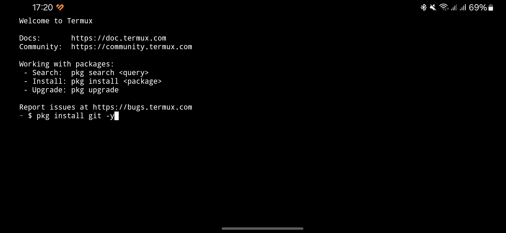

3. Clone this repo: `git clone https://github.com/Doneeel/auto-config-termux.git`
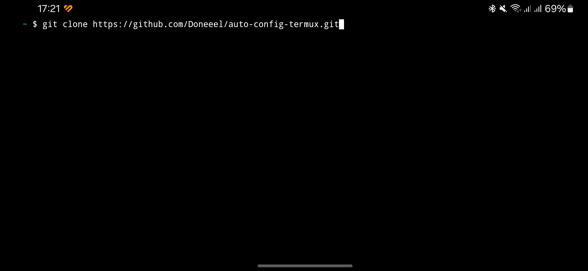

5. Give necessary permissions for running prereq file and run it: 
```bash
chmod +x 0_prereq.sh
./0_prereq.sh
```
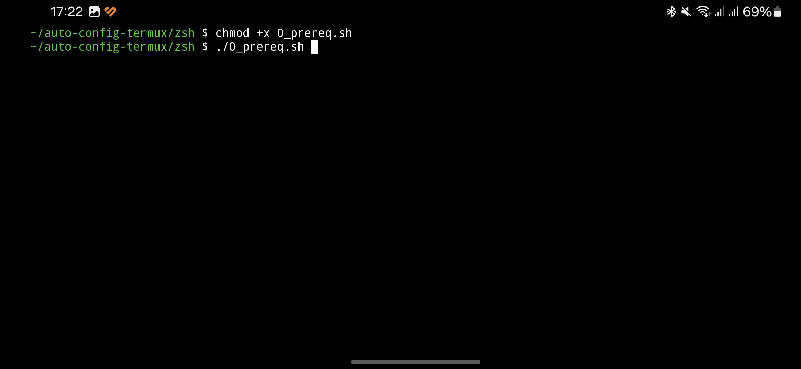

4. Run first part of zsh installation: `./1_install_zsh.sh`
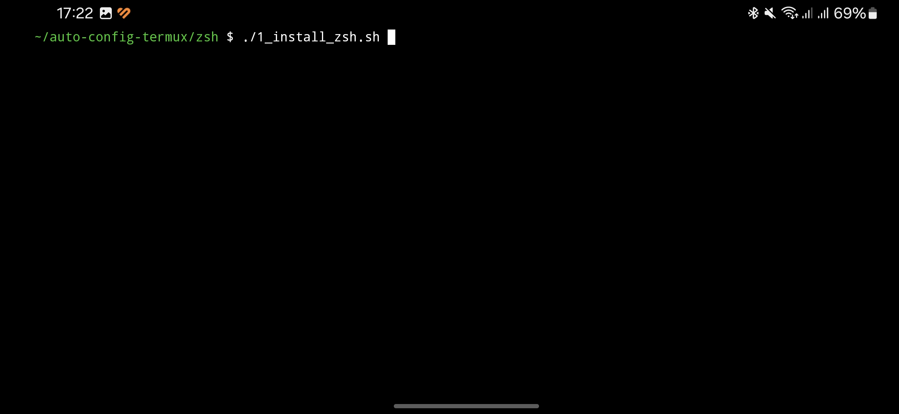

5. Change default shell to zsh
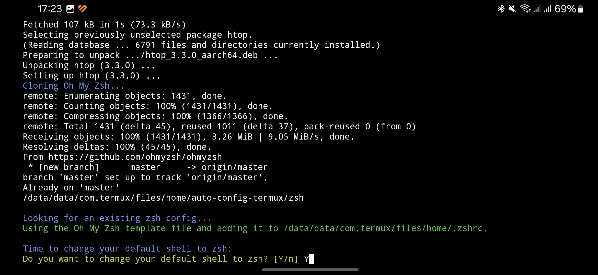

6. Run 2nd part of installation: `./2_setting_zsh_up.sh`
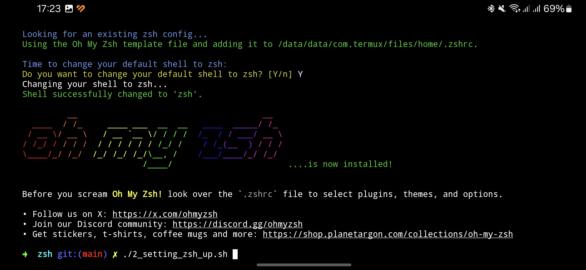

## 1.2: Style

1. Run termux-style for styling terminal: `termux-style`
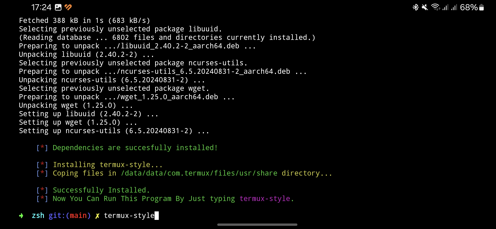

2. Select Colors and Fonts. After that - restart terminal
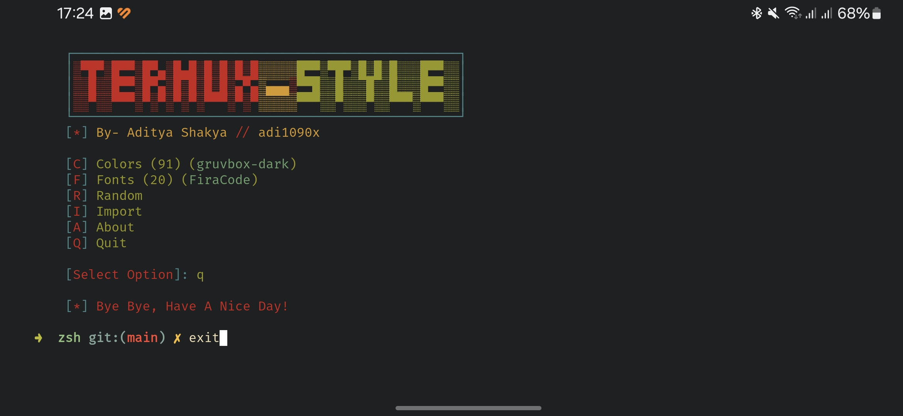

# Chapter 2: NVIM

1. Now with stylized terminal install nvim
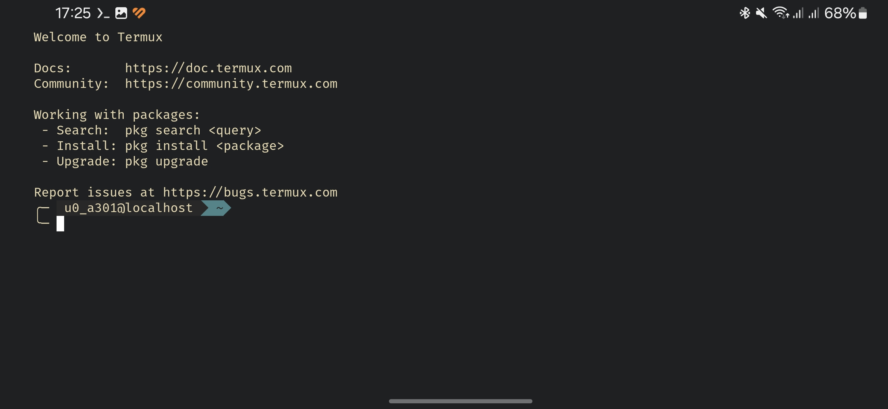

2. cd to nvim folder of repo, give permissions to install.sh and run it:
```bash
chmod +x install.sh
./install.sh
```
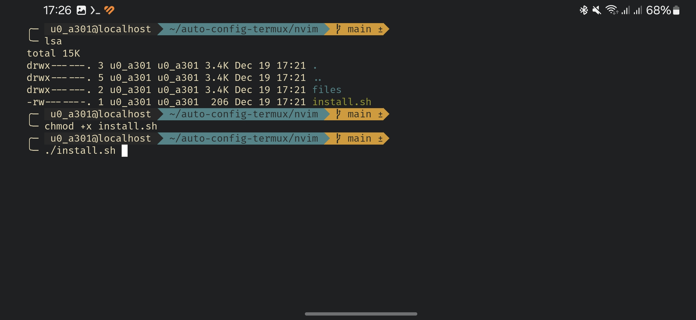

3. Wait for nvim magic
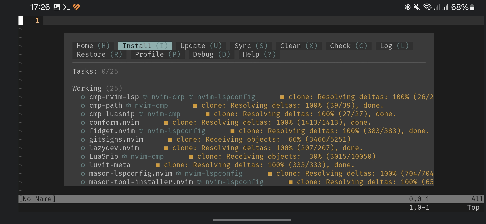

4. GG WP
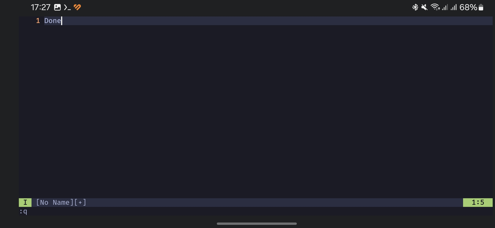
